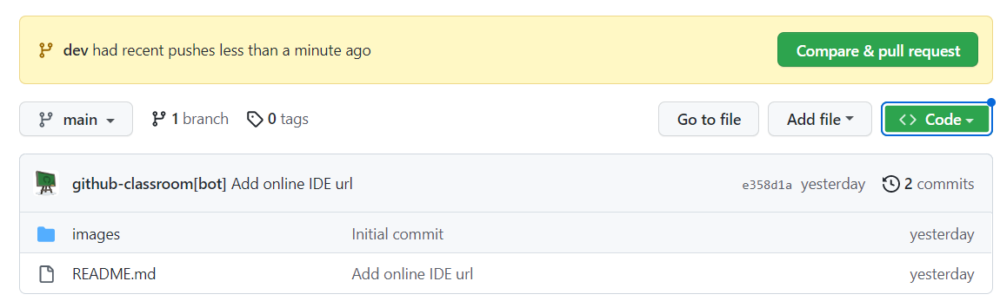

# Music Top

Here you will learn to use classes

## Steps

- Clone this repo:
    - click the green Code button in github, copy the URL
    - open the Visual Studio Code in your learning folder and and write in terminal `git clone <paste_your_url_here>`
- create a separate branch `git switch -c "dev"`
- add html and css files and code
- in VS Code, click on html file and Go Live (plugin installed previously) to avoid refreshing the page on changes
- when you're done coding, add the changes to staging using + button in VS Code Source Control tab or type on terminal `git add .`
 
- commit and push the code `git commit -am "commit message here"`, `git push -u origin dev`
- go to github and raise a pull request from your development branch to master
 

## Requirements

Continue your previous work on Music Top app, implementing classes as follows:

a) Define the following classes and implement the functions to work as mentioned below

Song:
  - public properties: 
    - name (String)
    - artist (String)
  - private properties:
    - entryTopDate (Date) - date the instance was created
    - votes (Number)
  - public functions:
    - vote() - increases the current vote count with 1 vote
    - getVoteCount() - returns the current number of votes
  - magic getters:
    - get entryTopDate() - returns the date the instance was created

MusicTop:
  - private properties:
    - songs (Array of Song)
  - public functions:
    - addSong(song) - adds a new song to the songs array
    - getTop() - returns an array of songs ordered based on their number of votes (songs with the most votes should be first). 
    if 2 songs have the same amount of votes, the ones which were added recently should appear before (on top of) the older ones

b) Create 1 instance of MusicTop called musicTopTest with at least 3 instances of Song. Every time you create a song instance, add it to the musicTopTest instance. Log the top in the console after adding all song instances. 

Simulate increasing the votes count for some songs. Log the top again after messing with the votes. Repeat these steps several times.

c) Create the following classes and implement the functions to work as mentioned below

HtmlSong:
  - extends the Song class above
  - public functions:
    - getHtml() - returns the html code with song info. the info must include:
      - song name
      - artist
      - vote count
      - date it was created (format 'dd/mm/yyyy hh:mm')
      - a button which says 'Vote'

MusicTopHtmlGenerator:
  - static functions:
    - getHtml(musicTop) - returns the entire music top as html code for the Array of HtmlSongs. the generated html code needs to contain the following elements
      - html elements specific for lists
      - each element in the list is a container for a song in the music top
      - besides the song info, also include the current possition in the top for each song

d) Continue your previous work on Music Top app:

- Create an empty songs array;
- After songs fetch success call:
    - instantiate every song obtained from response data with `new HtmlSong(songData)` and push the instance in the songs array (use `forEach`).
    - create an instance of `MusicTop` called `musicTop`, using the songs array as argument
    - render the songs to the DOM using the `getHtml()` method defined on `HtmlSong` class, instead your previously defined function 

- Add new songs. Every time you hit the submit button:
  - create a new `HtmlSong` instance
  - push/add the song instance to the `musicTop` instance
  - get the computed top from the new `musicTop` instance and pass it to `MusicTopHtmlGenerator` to get the full html code for the top.
  - take the full html songs top and place it in the songs div container in the page (clearing the previous songs)

e) Implement the voting functionality: each time a Vote button from a specific song is clicked, increase the vote count for that particular song (finding the song in the array and using the `vote()` method defined on the class) and update the top html code accordingly.

Notes:
- Only use vanilla/clean javascript and no frameworks
- You can add other private or public properties/functions to the classes mentioned above if you think that's necessary
- You can also create and use other objects and functions besides the instances mentioned above
